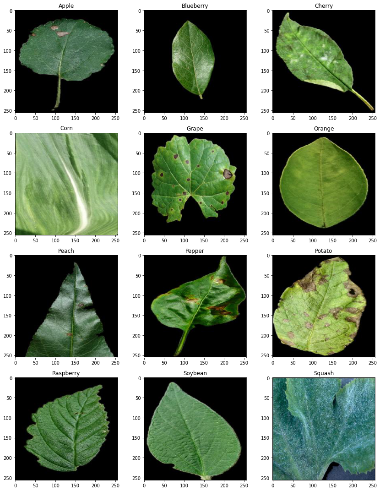
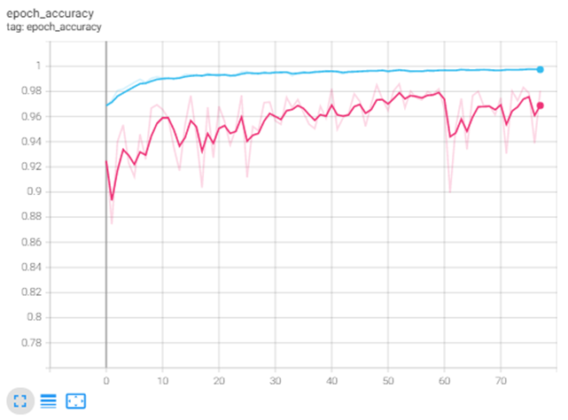

# Image Classification

Goal: classify images of leafs, which are divided into categories according to the species of the plant to which they belong. 
Being a classification problem, given an image, the goal is to predict the correct class label.

The problem is a multiclass classification problem. Thus, you must provide for each image in the test set the corresponding predicted class.

Only the training set is given. The test set is not provided. You must submit directly your code for evaluation.
The metric used to evaluate models is the Mean Accuracy. The score is computed as:

MeanAccuracy = Σ1≤i≤N(predictions_i == targets_i) / N , where N is the total number of images in the test set

## 1. Introduction
Dataset is unbalanced, so we use stratified sampling to preserve the proportion between training,validation and test set. Then we split offline with these percentage:
Training 70%, Validation 20%, Test 10%

Sample from each classes:

  

### 2.  Data  Augmentation
We perform data augmentation to achieve a better generalization generating different image at each epoch.

#### Transformations.
Rotating, Zooming,Flipping, Brightness, Shifting.

## 3. Model
VGG16 as feature extractor, then fine tuned using different class weights.

Performance:

MeanAccuracy Training set = 0.91

Mean Accuracy Test set = 0.88

Purple is TransferLearning Model and blue is FineTuned Model

  

