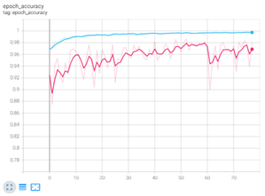

# Image Classification

Goal: classify images of leafs, which are divided into categories according to the species of the plant to which they belong. 
Being a classification problem, given an image, the goal is to predict the correct class label.

The problem is a multiclass classification problem. Thus, you must provide for each image in the test set the corresponding predicted class.

Only the training set is given. The test set is not provided. You must submit directly your code for evaluation.
The metric used to evaluate models is the Mean Accuracy. The score is computed as:

MeanAccuracy = Σ1≤i≤N(predictions_i == targets_i) / N , where N is the total number of images in the test set

## 1. Introduction
The  given  dataset  is  unbalanced  with  respect  to  theclasses  distribution,  then  we  decided  to use different class weights
in  order  to  preserve  the  full  dataset proportions both in training, validation and testing.

### 2.  Data  Augmentation
Due  to  the  reduced  dimension  of  the  proposed  datasetcompared to the parameters complexity of the underlying 
architecture, Data Augmentation purpouse consists in solving this issue by generating at run time several new transformed images
which allow a better generalized performance of the model.

#### Transformations.
Rotating,  Zooming,Flipping, Brightness, Shifting.

## 3. Model
VGG16 as feature extractor, then fine tuned using different class weights.

Performance:

MeanAccuracy Training set = 0.91

Mean Accuracy Test set = 0.88

  

